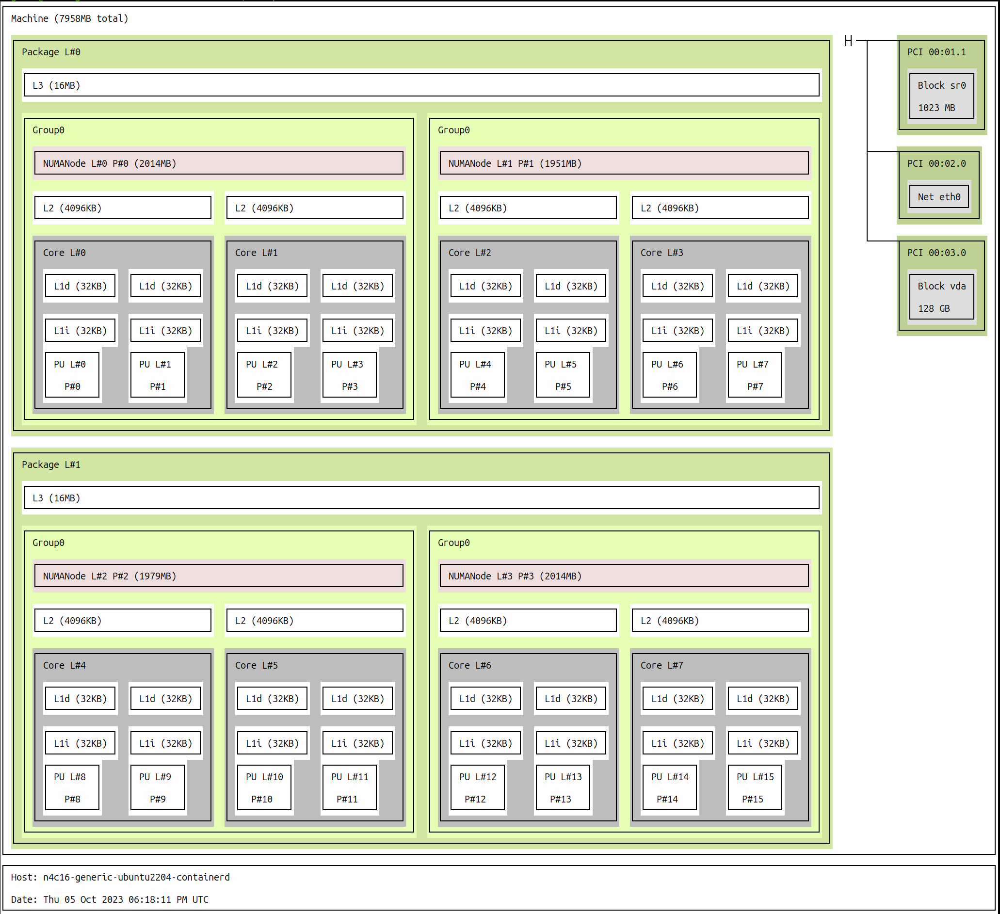

## Before you begin

##### Required
1. Either containerd or CRI-O container runtimes installed, with containerd requiring at least release version 1.7.0 or later, and CRI-O needing release version 1.26.0 or later.
1. Kubernetes cluster up and running.
1. Helm installed. This is necessary for the installation of the Topology-Aware NRI plugin through the Helm chart.
## Install Topology-aware NRI plugin

Same steps can be re-used for installing Balloons NRI plugins too.

1. Clone the NRI Plugins GitHub repository and navigate to the root directory. Currently, there are no publicly available Helm charts, so we need to clone the repository in order to utilize the local Helm charts.

    ```sh
    git clone https://github.com/containers/nri-plugins.git
    cd nri-plugins
    ```

1. Install the Topology-Aware NRI plugin. We'll install the plugin in the `kube-system` namespace. By default, NRI is disabled in both runtimes and needs to be enabled for any plugins to function. We will allow the Helm chart to activate the NRI feature on the containerd for us by passing the `nri.patchContainerdConfig` parameter before installing the plugin.

    ```sh
    helm install topology-aware deployment/helm/resource-management-policies/topology-aware/ --namespace kube-system --set nri.patchContainerdConfig=true
    ```

1. Verify that NRI is enabled on the containerd's config file. 

    ```sh
    cat /etc/containerd/config.toml  | grep -A 2 nri

    [plugins.'io.containerd.nri.v1.nri']
      disable = false    
    ```

1. Confirm that Topology-Aware plugin DaemonSet Pods are running with the following command.

    ```sh
    kubectl get pods -n kube-system -l=app.kubernetes.io/name=nri-resource-policy-topology-aware


    NAME                                       READY   STATUS    RESTARTS   AGE
    nri-resource-policy-topology-aware-tlqkp   1/1     Running   0          7m2s

    ```

    Wait until each instance of NRI Pod is in Running STATUS.

## Verify resource allocation post-plugin installation

While the Topology-Aware NRI Plugin offers various configuration options to fine-tune resource management, it can also be utilized with zero configuration. For this demonstration, we'll start by installing a workload Pod that consists of two containers sharing resources (CPU and memory), and two containers with exclusive allocations (CPU and memory). We will then compare the behavior before and after installing the Topology-Aware plugin to analyze the differences.

1. First let's check the NUMA architecture of our node. Either numactl utility or hwloc can be used.

    ```sh
    numactl -H

    available: 4 nodes (0-3)
    node 0 cpus: 0 1 2 3
    node 0 size: 2013 MB
    node 0 free: 229 MB
    node 1 cpus: 4 5 6 7
    node 1 size: 1950 MB
    node 1 free: 1082 MB
    node 2 cpus: 8 9 10 11
    node 2 size: 1979 MB
    node 2 free: 273 MB
    node 3 cpus: 12 13 14 15
    node 3 size: 2014 MB
    node 3 free: 875 MB
    node distances:
    node   0   1   2   3 
    0:  10  11  21  21 
    1:  11  10  21  21 
    2:  21  21  10  11 
    3:  21  21  11  10 
    ```

    ```sh
    lstopo --of ascii
    ```

    

    As you can see, it is 4 NUMA node based host.

1. Create the workload Pod. Prior to executing the following command, ensure that the Topology-Aware plugin has not been installed in the cluster yet.

    ```sh
    kubectl create -f workload_pod.yaml -n default
    ```

1. After the Pod is up and running, we can execute the report.sh custom Bash script. This script provides a  breakdown of allocated resources for each container within the workload Pod. It gathers this information by inspecting the process status data.

    ```sh
    # Speficy the namespace (via NS variable) of the workload that you are interested in anaylying its resource allocation.
    NS=default
    ./report.sh
    ```

    ```
    * resources for busybox:c0-shared
        Cpus_allowed_list:	0-15
        Mems_allowed_list:	0-3
    * resources for busybox:c1-shared
        Cpus_allowed_list:	0-15
        Mems_allowed_list:	0-3
    * resources for busybox:c2-exclusive
        Cpus_allowed_list:	0-15
        Mems_allowed_list:	0-3
    * resources for busybox:c3-exclusive
        Cpus_allowed_list:	0-15
        Mems_allowed_list:	0-3
    ```

    The above output shows the CPU and memory allocation for each container  prior to the installation of the Topology-Aware plugin. In a standard Kubernetes setup, all CPUs are shared among the four containers. Since Kubernetes lacks awareness of the underlying hardware architecture, it cannot perform resource-optimized workload scheduling.

1. Next, we'll proceed by removing our current workload, installing the Topology-Aware NRI plugin, and then re-installing the workload

    ```sh
    kubectl delete -f workload_pod.yaml -n default

    # Install the plugin via Helm chart
    helm install topology-aware ../../nri-plugins/deployment/helm/resource-management-policies/topology-aware/ --namespace kube-system --set nri.patchContainerdConfig=true
    ```

1. Once workload Pod is running, run the report.sh script

    ```sh
    NS=default
    ./report.sh
    ```

    ```
    * resources for busybox:c0-shared
        Cpus_allowed_list:	9-11
        Mems_allowed_list:	2
    * resources for busybox:c1-shared
        Cpus_allowed_list:	12-15
        Mems_allowed_list:	3
    * resources for busybox:c2-exclusive
        Cpus_allowed_list:	4
        Mems_allowed_list:	1
    * resources for busybox:c3-exclusive
        Cpus_allowed_list:	8
        Mems_allowed_list:	2
    ```

    This time, you'll notice that the c2-exclusive and c3-exclusive containers are assigned dedicated CPUs, whereas c0-shared and c1-shared share CPUs, from different NUMA nodes. As mentioned previously, we didn't configure the Topology-Aware plugin to achieve this outcome. However, there are additional optimizations that can be made by fine-tuning the plugin settings.

## Recording
You can watch the above steps in action via this recording: https://asciinema.org/a/612263
